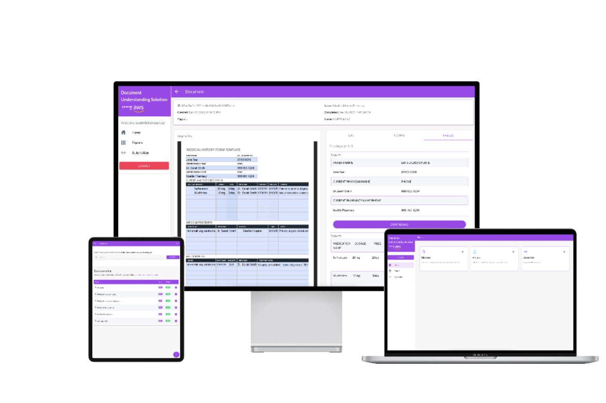
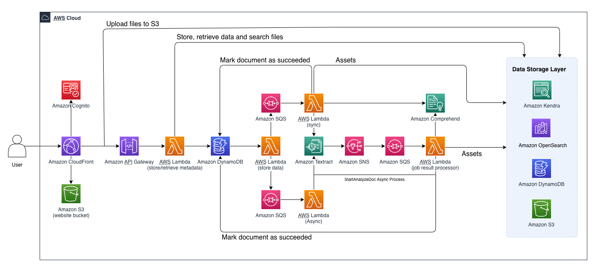

# Document Understanding Solution

This solution leverages the power of Amazon Textract, Amazon Comprehend, Amazon Elasticsearch to provide digitization, domain-specific data discovery, redaction controls, structural component extraction and other document processing & understanding capaibilities.



## Architecture Diagram



**Note**

> Current document formats supported: **PDF,JPG,PNG**
> Current maximum document file size supported: **150MB**
> Current concurrent document uploads (via UI) supported: **100**


## Folder Structure

This project contains source code and supporting files for a serverless application that you can deploy with the SAM CLI. It includes the following files and folders.

- functions - Code for the application's Lambda functions written in TypeScript.
- layers - Code for the application's Lambda layers written in TypeScript.
- events - Invocation events that you can use to invoke the function.
- template.yaml - A template that defines the application's AWS resources.

The application uses several AWS resources, including Lambda functions and an API Gateway API. These resources are defined in the `template.yaml` file in this project. You can update the template to add AWS resources through the same deployment process that updates your application code.

## Deployment

The Serverless Application Model Command Line Interface (SAM CLI) is an extension of the AWS CLI that adds functionality for building and testing Lambda applications. It uses Docker to run your functions in an Amazon Linux environment that matches Lambda. It can also emulate your application's build environment and API.

To use the SAM CLI, you need the following tools.

* SAM CLI - [Install the SAM CLI](https://docs.aws.amazon.com/serverless-application-model/latest/developerguide/serverless-sam-cli-install.html)
* Node.js - [Install Node.js 19](https://nodejs.org/en/), including the NPM package management tool.
* Docker - [Install Docker community edition](https://hub.docker.com/search/?type=edition&offering=community)

To build and deploy your application for the first time, run the following in your shell:

```bash
sam build

or
sam build --use-container

sam deploy --guided
```

The first command will build the source of your application. The second command will package and deploy your application to AWS.

> Once deployed, you should recieve an email titled *Your temporary password* that contains master username and a temporary password

## Stack Outputs

Once the SAM deploy command completes, you will find a list of useful properties displayed. 

* *Website* - URL to access the UI part
* *OpenSearchDashboardUrl* - OpenSeach Dashboard url

## Setup OpenSearch Fine-grained access control with Cognito

You first have to give access to index documents for Lambda function. 

1. Locate role ARN for Process Job Completion function from Cloudformation outputs named *ProcessJobCompletionFunctionIamRole*.
2. Go to OpenSeach Dashboard and sign in with master user
3. From Security > Roles > all_access > Mapped users
 provide backend role mapping of the function role

> More details on Fine-grained access for OpenSearch can be found [here](https://docs.aws.amazon.com/opensearch-service/latest/developerguide/fgac.html)

## Upload Website Content to S3

1. Build the app
```bash
npm run build:prod
```
2. Sync local folder with S3 bucket
```bash
aws s3 sync www $frontend_bucket_name
```

## Cost

- As you deploy this sample application, it creates different resources (Amazon S3 bucket, Amazon SQS Queue, Amazon DynamoDB table, Elasticsearch (and potenitally Amazon Kendra) clsuter(s) and AWS Lambda functions etc.). When you analyze documents, it calls different APIs (Amazon Textract, Amazon Comprehend) in your AWS account. You will get charged for all the API calls made as part of the analysis as well as any AWS resources created as part of the deployment. To avoid any recurring charges, delete stack.

> Follow [Cleanup](#cleanup) section to remove stack


- You are responsible for the cost of the AWS services used while running this reference
  deployment. The solution consists of some resources that have to be paid by the hour/size
  such as Amazon Elasticsearch, Amazon Kendra and Amazon S3 while others are serverless technologies where
  costs are incurred depending on the number of requests.
  The approximate cost for the solution for 100 documents/day comes under $20/day. For accurate and most up-to-date pricing information, refer [AWS Pricing](https://aws.amazon.com/pricing/)


## Use the SAM CLI to build and test locally

Build your application with the `sam build` command.

```bash
ocr-app$ sam build
```

The SAM CLI installs dependencies defined in `hello-world/package.json`, compiles TypeScript with esbuild, creates a deployment package, and saves it in the `.aws-sam/build` folder.

Test a single function by invoking it directly with a test event. An event is a JSON document that represents the input that the function receives from the event source. Test events are included in the `events` folder in this project.

Run functions locally and invoke them with the `sam local invoke` command.

```bash
ocr-app$ sam local invoke HelloWorldFunction --event events/event.json
```

The SAM CLI can also emulate your application's API. Use the `sam local start-api` to run the API locally on port 3000.

```bash
ocr-app$ sam local start-api
ocr-app$ curl http://localhost:3000/
```

The SAM CLI reads the application template to determine the API's routes and the functions that they invoke. The `Events` property on each function's definition includes the route and method for each path.

```yaml
      Events:
        HelloWorld:
          Type: Api
          Properties:
            Path: /hello
            Method: get
```

## Add a resource to your application
The application template uses AWS Serverless Application Model (AWS SAM) to define application resources. AWS SAM is an extension of AWS CloudFormation with a simpler syntax for configuring common serverless application resources such as functions, triggers, and APIs. For resources not included in [the SAM specification](https://github.com/awslabs/serverless-application-model/blob/master/versions/2016-10-31.md), you can use standard [AWS CloudFormation](https://docs.aws.amazon.com/AWSCloudFormation/latest/UserGuide/aws-template-resource-type-ref.html) resource types.

## Fetch, tail, and filter Lambda function logs

To simplify troubleshooting, SAM CLI has a command called `sam logs`. `sam logs` lets you fetch logs generated by your deployed Lambda function from the command line. In addition to printing the logs on the terminal, this command has several nifty features to help you quickly find the bug.

`NOTE`: This command works for all AWS Lambda functions; not just the ones you deploy using SAM.

```bash
ocr-app$ sam logs -n HelloWorldFunction --stack-name ocr-app --tail
```

You can find more information and examples about filtering Lambda function logs in the [SAM CLI Documentation](https://docs.aws.amazon.com/serverless-application-model/latest/developerguide/serverless-sam-cli-logging.html).

## Unit tests

Tests are defined in the `hello-world/tests` folder in this project. Use NPM to install the [Jest test framework](https://jestjs.io/) and run unit tests.

```bash
ocr-app$ cd hello-world
hello-world$ npm install
hello-world$ npm run test
```

## Cleanup

To delete the sample application that you created, use the AWS CLI. Assuming you used your project name for the stack name, you can run the following:

```bash
aws cloudformation delete-stack --stack-name ocr-app
```

## Resources

See the [AWS SAM developer guide](https://docs.aws.amazon.com/serverless-application-model/latest/developerguide/what-is-sam.html) for an introduction to SAM specification, the SAM CLI, and serverless application concepts.

Next, you can use AWS Serverless Application Repository to deploy ready to use Apps that go beyond hello world samples and learn how authors developed their applications: [AWS Serverless Application Repository main page](https://aws.amazon.com/serverless/serverlessrepo/)

## License

This project is licensed under the Apache-2.0 License.
You may not use this file except in compliance with the License. A copy of the License is located at
http://www.apache.org/licenses/

## Additional Notes

The intended use is for users to use this application as a reference architecture to build production ready systems for their use cases. Users will deploy this solution in their own AWS accounts and own the deployment, maintenance and updates of their applications based on this solution.

Unless required by applicable law or agreed to in writing, software distributed under the License is distributed on an "AS IS" BASIS, WITHOUT WARRANTIES OR CONDITIONS OF ANY KIND, either express or implied. See the License for the specific language governing permissions and limitations under the License.
